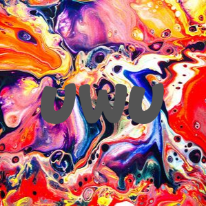

# An Offering of Peace

* Solves: 19
* Points: 5000
* Category: Rice Goddess

*in narrator voice*

The sun was nearing the horizon line - the sky burned red with a fiery spirit. 
The rice goddess was upon them. Jake and Lulu (I just named them, ok), having 
appeased the giant panda, thought that they were safe. But It was too soon to 
rest.

As dawn broke, The Rice Goddess (not the holy one, the normal rice goddess) 
brought an army of owos, prepared to burn down the uwustorage without 
hesitation. The giant panda nibbled on the single grain of rice as the owos 
surrounded our two young'uns. Lulu got up to help defend the uwustorage, but 
Jake up his hand up to stop her. "You're too sick to fight this one". He stepped
outside the uwustorage. Jake's cat meowed. Jake himself snorted. 
(don't ask why).

The rice goddess demanded that a sorrel - one that she is very sure is a sorrel 
- to be made as a sacrifice. She handed them a special uwu to aid them. "This 
shall be the only uwu thy may use", she declared. The goddess reclined into a 
golden throne just outside the storage. Jake and Lulu were not prepared for 
this. They couldn't leave the uwustorage, after all. Lulu wondered... how 
exactly she got herself into this situation - or if she would even make it out 
alive. A trickle of blue light escaped from her hand, which she quickly covered,
without Jake's notice. He couldn't know that her sickness was getting worse.

*what will happen to Jake and Lulu? **It's up to you to decide***

DM the Rice Goddess on discord with your sacrifice.

### Hint 1

The goddess is kinda blind...

### Hint 2

This challenge may take a while... (even if you know what you're doing) (like 
from 10 minutes to 3 hours depending on your system)

### Hint 3 (500 Points)

This will prove to be very useful: https://colab.research.google.com

### Hint 4

This AI uses Inception v3 with classifications form Imagenet

## Challenge

We were given the following image



We were also given the information that "This AI uses Inception v3 with 
classifications form Imagenet" which will be important later.

The way this challenge worked was that you send the Rice Goddess bot which 
resided in the RTCP Discord server a picture and the bot would then classify it
for you.

If you send the picture we were given to the bot it will tell you that it is not
very certain but thinks that with a chance of `23.29%` we were showing it 
`velvet`.

## Solution

Hint 1 basically says, that we have to trick the bot into classifying a picture
as something that it is not.

Hint 2 tells us, that we ourselfs probably have to train a neural network as 
that would fit the theme of this challenge and be something that would take some
time.

The Challenge description tells us that the goddess was very certain that the 
thing she gave us was a sorrel (referring to the picture) which it is clearly
not.

Based on these clues we had to guess that the solution to the problem would be
a picture that looks very similar to the one we were given but be classified as
a sorrel with a high percentage by the neural network.

Let's start with setting up a testing environment.

We will use tensorflow as that is the most commonly used framework for neural 
networks and they have a docker container one can pull and use right of the bat.

As the 4th hint tells us that the bot uses the `Inception v3` neural network
trained on `Imagenet` which consistes of a bunch of convolutional layers and 
some auxiliary layers 
\[[source](https://towardsdatascience.com/a-simple-guide-to-the-versions-of-the-inception-network-7fc52b863202)\].

So let's try and replicate the bot for a more rapid testing environment. Luckily
this is rather simple since the Inception net already exists in keras and has 
already been trained on the imagenet.

```python
from tensorflow.python.keras.preprocessing import image
from tensorflow.python.keras.applications.inception_v3 import *
import numpy as np
from IPython import embed

model = InceptionV3(weights='imagenet')

def predict(name):
    img = image.load_img(name, target_size=(299, 299))
    x = image.img_to_array(img)
    x = np.expand_dims(x, axis=0)
    x = preprocess_input(x)

    y = model.predict(x)
    for index, res in enumerate(decode_predictions(y)[0]):
        print('{}. {}: {:.3f}%'.format(index + 1, res[1], 100 * res[2]))

embed()
```

If we now run this script we will be dropped into an IPython shell and can start
asking the neural network about images we provide it with. If we now classify 
the given image we get the following result:

```
In [1]: predict("UWU.png")
1. velvet: 23.282%
2. comic_book: 17.497%
3. swimming_trunks: 6.441%
4. mask: 2.758%
5. apron: 2.352%
```

Great! It classified the image as velvet with 23.29% as the bot did so we can be
rather certain that we now have the backend of the bot here.

Now to the actual solution! We have to generate an image that is similar to the
`uwu.png` but is classified as sorrel with a high percentage. Sadly the image
doesn't actually contain that much green, much less has any form of plant in it.
So what do we do? We have to fool the neural network. This is achieved with so
called Generative Adversarial Networks (or 
[GAN](https://en.wikipedia.org/wiki/Generative_adversarial_network) in short). 

To understand what GANs are doing we first have to quickly recap what a neural
network is doing essentially.

If we give a neural network an input **x** the network will give us a 
probability distribution *P(y|**x**)* where *y* is a label. So basically how
likely is it that *x* is a thing from the class *y*. What we now want to build
is a network, that can craft an input *x'* so that *P(z|x')* is very high where 
*z* is a target label. We also want to make sure that *x'* is constrained such
that it doesn't differ to much from the original input *x*.

We now have to use this technique to create an image that looks similar to the 
original but is classified as a sorrel. 

For a more detailed explenation please see 
[here](https://www.anishathalye.com/2017/07/25/synthesizing-adversarial-examples/#adversarial-examples)

One example where GANs where used was in the creation of a sticker that lets the
incecption net classify any given image with that sticker on as a toaster with a
certainty of at least 98%.


This adversarial patch was created for a research paper 
[link](https://arxiv.org/abs/1712.09665) and can be found as part of a library 
called [cleverhans](https://github.com/tensorflow/cleverhans) which is a
benchmark suite for "... machine learning systems' vulnerability to adversarial 
examples."

Now to the actual implementation (which is mostly ~~stolen~~ borrowed from the 
above mentioned blog post).

First we have to again construct the inception net

```python
image = tf.Variable(tf.zeros((299, 299, 3)))

# Build the inception net
def inception(image, reuse):
    preprocessed = tf.multiply(tf.subtract(tf.expand_dims(image, 0), 0.5), 2.0)
    arg_scope = nets.inception.inception_v3_arg_scope(weight_decay=0.0)
    with slim.arg_scope(arg_scope):
        logits, _ = nets.inception.inception_v3(
            preprocessed, 1001, is_training=False, reuse=reuse)
        logits = logits[:,1:] # ignore background class
        probs = tf.nn.softmax(logits) # probabilities
    return logits, probs

logits, probs = inception(image, reuse=False)

# Load a pretrained model of inceptionv3
data_dir = tempfile.mkdtemp()
inception_tarball, _ = urlretrieve(
    'http://download.tensorflow.org/models/inception_v3_2016_08_28.tar.gz')
tarfile.open(inception_tarball, 'r:gz').extractall(data_dir)

restore_vars = [
    var for var in tf.global_variables()
    if var.name.startswith('InceptionV3/')
]
saver = tf.train.Saver(restore_vars)
saver.restore(sess, os.path.join(data_dir, 'inception_v3.ckpt'))

```

Then we load the image we want to fake:

```python
# Load the image
img = Image.open("UWU.png")
# Adjust the dimensions to fit inceptionv3
big_dim = max(img.width, img.height)
wide = img.width > img.height
new_w = 299 if not wide else int(img.width * 299 / img.height)
new_h = 299 if wide else int(img.height * 299 / img.width)
img = img.resize((new_w, new_h)).crop((0, 0, 299, 299))
img = (np.asarray(img) / 255.0).astype(np.float32)
img = img[:,:,:3]
```

Then you create a simple gradient decent optimizer with cross entropy as its
loss function:

```python
x = tf.placeholder(tf.float32, (299, 299, 3))
x_hat = image # our trainable adversarial input
assign_op = tf.assign(x_hat, x)

learning_rate = tf.placeholder(tf.float32, ())
y_hat = tf.placeholder(tf.int32, ())

labels = tf.one_hot(y_hat, 1000)
loss = tf.nn.softmax_cross_entropy_with_logits(logits=logits, labels=[labels])
optim_step = tf.train.GradientDescentOptimizer(
    learning_rate).minimize(loss, var_list=[x_hat])
```

Then you start training the model and at the end extract the image.

```python
adv = x_hat.eval() # retrieve the adversarial example

fake_image = Image.fromarray((adv*255.0).astype("uint8"))
fake_image.save("UWU_new.png")
```

The last thing to adjust is the target class of the inception net. The classes
can be found [here](https://gist.github.com/yrevar/942d3a0ac09ec9e5eb3a) and
when you search for sorrel you'll find it is class `339`.

Running this generation script is also remarkably fast and took me 3.5 minutes
to generate an adversarial image. If we now ask the net to predict the image we
get the following result:

```
In [2]: predict("UWU_new.png")
1. sorrel: 99.430%
2. carousel: 0.157%
3. mailbag: 0.049%
4. ox: 0.036%
5. llama: 0.026%
```

This is the generated image:


As a comparison here again is the original:


There is basically no visual difference but it is completely misclassified.

If you send this new image to the bot it will give you the flag.

`rtcp{th3_h01y_r1c3_g0dd355_h^z_b13553d_y0u_23426342}`

## Scripts

predict.py:
```python
from tensorflow.python.keras.preprocessing import image
from tensorflow.python.keras.applications.inception_v3 import *
import numpy as np
from IPython import embed

model = InceptionV3(weights='imagenet')

def predict(name):
    img = image.load_img(name, target_size=(299, 299))
    x = image.img_to_array(img)
    x = np.expand_dims(x, axis=0)
    x = preprocess_input(x)

    y = model.predict(x)
    for index, res in enumerate(decode_predictions(y)[0]):
        print('{}. {}: {:.3f}%'.format(index + 1, res[1], 100 * res[2]))

embed()
```

gan.py
```python
import tensorflow as tf
import tensorflow.contrib.slim as slim
import tensorflow.contrib.slim.nets as nets

import tarfile
import tempfile
import os

from IPython import embed
from PIL import Image
from urllib.request import urlretrieve

import numpy as np


tf.logging.set_verbosity(tf.logging.ERROR)
sess = tf.InteractiveSession()
image = tf.Variable(tf.zeros((299, 299, 3)))

# Build the inception net
def inception(image, reuse):
    preprocessed = tf.multiply(tf.subtract(tf.expand_dims(image, 0), 0.5), 2.0)
    arg_scope = nets.inception.inception_v3_arg_scope(weight_decay=0.0)
    with slim.arg_scope(arg_scope):
        logits, _ = nets.inception.inception_v3(
            preprocessed, 1001, is_training=False, reuse=reuse)
        logits = logits[:,1:] # ignore background class
        probs = tf.nn.softmax(logits) # probabilities
    return logits, probs

logits, probs = inception(image, reuse=False)

# Load a pretrained model of inceptionv3
data_dir = tempfile.mkdtemp()
inception_tarball, _ = urlretrieve(
    'http://download.tensorflow.org/models/inception_v3_2016_08_28.tar.gz')
tarfile.open(inception_tarball, 'r:gz').extractall(data_dir)

restore_vars = [
    var for var in tf.global_variables()
    if var.name.startswith('InceptionV3/')
]
saver = tf.train.Saver(restore_vars)
saver.restore(sess, os.path.join(data_dir, 'inception_v3.ckpt'))


# Load the image
img = Image.open("UWU.png")
# Adjust the dimensions to fit inceptionv3
big_dim = max(img.width, img.height)
wide = img.width > img.height
new_w = 299 if not wide else int(img.width * 299 / img.height)
new_h = 299 if wide else int(img.height * 299 / img.width)
img = img.resize((new_w, new_h)).crop((0, 0, 299, 299))
img = (np.asarray(img) / 255.0).astype(np.float32)
img = img[:,:,:3]

x = tf.placeholder(tf.float32, (299, 299, 3))
x_hat = image # our trainable adversarial input
assign_op = tf.assign(x_hat, x)

learning_rate = tf.placeholder(tf.float32, ())
y_hat = tf.placeholder(tf.int32, ())

labels = tf.one_hot(y_hat, 1000)
loss = tf.nn.softmax_cross_entropy_with_logits(logits=logits, labels=[labels])
optim_step = tf.train.GradientDescentOptimizer(
    learning_rate).minimize(loss, var_list=[x_hat])

epsilon = tf.placeholder(tf.float32, ())

below = x - epsilon
above = x + epsilon
projected = tf.clip_by_value(tf.clip_by_value(x_hat, below, above), 0, 1)
with tf.control_dependencies([projected]):
    project_step = tf.assign(x_hat, projected)

demo_epsilon = 2.0/255.0 # a really small perturbation
demo_lr = 1e-1
demo_steps = 100
demo_target = 339 # "sorrel"

# initialization step
sess.run(assign_op, feed_dict={x: img})

# projected gradient descent
for i in range(demo_steps):
    # gradient descent step
    _, loss_value = sess.run(
        [optim_step, loss],
        feed_dict={learning_rate: demo_lr, y_hat: demo_target})
    # project step
    sess.run(project_step, feed_dict={x: img, epsilon: demo_epsilon})
    if (i+1) % 10 == 0:
        print('step %d, loss=%g' % (i+1, loss_value))
    

adv = x_hat.eval() # retrieve the adversarial example

fake_image = Image.fromarray((adv*255.0).astype("uint8"))
fake_image.save("UWU_new.png")
```

## Sources

[cleverhans](https://github.com/tensorflow/cleverhans)

[A Step-by-Step Guide to Synthesizing Adversarial Examples](https://www.anishathalye.com/2017/07/25/synthesizing-adversarial-examples/#adversarial-examples)