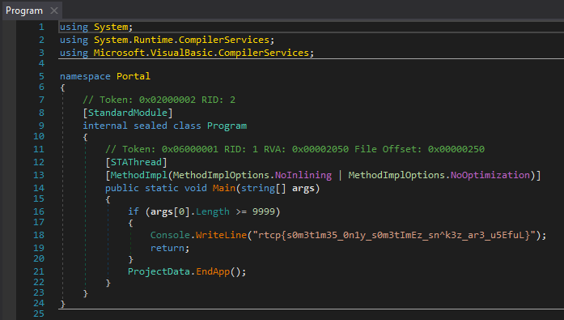

# print(f) to Pay Respects

* Solves: 130
* Points: 100
* Category: Binary/Excecutable

Lulu recently began to collect rice granules, she needs so many! (like over 
9999) Jake says it might be a cure to Lulu's disease. Go help her get enough by
throwing rice at the portal, print(f) to pay respects.

### Hint 1

Careful not to throw rice in the wrong direction, just thow it close by (not 
into) the portal - Jake can pick it up later.

## Challenge

You were given a zip file that included a `Portal.exe`, `Portal.dll` and several
other files.

## Solution

At first I wanted to check what kind of executables the files are, so I ran the
`file` command on them.

```
file Portal.exe
Portal.exe: PE32 executable (console) Intel 80386, for MS Windows
file Portal.dll
Portal.dll: PE32 executable (console) Intel 80386 Mono/.Net assembly, for MS Windows
```

Usually if we are given an executable and a library together, the juicy bits are
located in the library so I looked at that first. (Another factor might have 
been, that the `.dll` was a .Net binary which has several very good decompiler).
My weapon of choice for .Net usually is `dnSpy` but that is just because I have
never really used any other .Net decompiler. And after looking through the file
for a bit I found the flag.



Alternatively `strings` would've helped with the `-e l` which changes the 
encoding to 16 bit little endian, which is what windows uses by default.

```
strings -e l Portal.dll | grep rtcp
rtcp{s0m3t1m35_0n1y_s0m3tImEz_sn^k3z_ar3_u5EfuL}
```