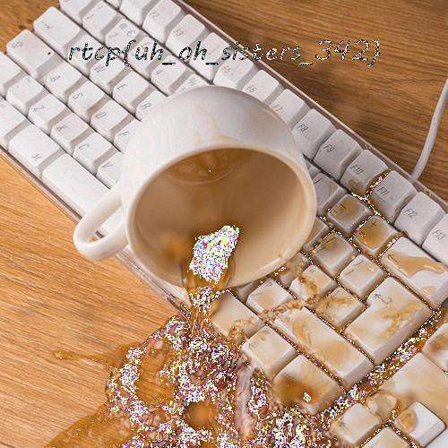

# Screams

- Solves: 66
- Points: 1500
- Category: Reversing

You know what, you fix this lol

### Hint:

<https://github.com/JEF1056/riceteacatpanda/tree/master/screams%20(1500)>

## Challenge

The challenge provided two files: `aaaaaaaaaaaaaaaaaa.wav` and `ur-worst-nightmare.py`.

This is the content of the python script:
```python
import cv2 as               a
import soundfile as         b
import random as            c
import numpy as             d
from tqdm import tqdm as    e
import os as                f
import binascii as          z

g, h = a.imread("pls-no.jpg"), b.SoundFile("oh-gawd-plsno.wav", 'r')
i, j = g.shape[0], 0
k=d.zeros((i*i,2), dtype=d.float64)
l, m = e(total=i*i), h.read()
l.set_description(" nuKiNG")
h.close()
u=True

t = b'9\x04\x00\x00\x00\x00\x00\x00\x00\x00\x00\x00\x00\x00\x00\x00'
v = b'@\xe4\x10\x00\x00\x00\x00\x00\x00\x00\x00\x00\x00'

for             n           in range(0,i):
    for         o       in range(0,i):
        if      u     == True:

            p, q, r = g[n][o][0], g[n][o][1], g[n][o][2]; p, q, r = str(p), str(q), str(r)
                        #    me          me          me
            while len(p) < 3:
                p="0"+p
                while len(q) < 3:
                    q="0"+q
                    while len(r) < 3:
                        r="0"+r#eeeeeeeeeeeeeeeeeeeeeeeeeeeeeeeeeeeeeeeeeeeeeeeeeee
            result = p+q+r
            for w in range(0, j+1):
                x=z.b2a_uu(t);                y=z.b2a_uu(v)
            t = z.a2b_uu("0.00")
            #         ww
            v = z.a2b_uu("-0.00")
            s=c.randint(0,1)
            if s == 0: k[j]=(m[j][0]*2,float(x.decode()[:-2].strip(" ")+result))
            if s == 1: k[j]=(m[j][0]*2,float(y.decode()[:-2].strip(" ")+result))
            j+=1
           #b
            l.update(1)

            #wow   0   then
b.write('out.wav', k, 44100, 'FLOAT')
```

The task therefore is to understand what the script does and `reverse` it.

## Solution

_Note: You will need the python `pysoundfile` module for this challenge. Also at the time of the ctf this module would not work with python version 3.8 so we used python2 for it._


After some rearranging and rewriting of the script we got it to this form:

```python
import cv2
import soundfile
import numpy
import random

# read in the soundfile
sound_file = soundfile.SoundFile("oh-gawd-plsno.wav", 'r')
sound = sound_file.read()
sound_file.close()

# get the image with the flag
image = cv2.imread("pls-no.jpg")
height = image.shape[0]

# initialize the wav_data with 2 channels and all zero values
wav_data = numpy.zeros((height*height, 2), dtype=numpy.float64)

i = 0
# iterate over pixels from image
for h in range(0, height):
    for w in range(0, height):
        # get rgb value of the current pixel
        r, g, b = image[h][w][0], image[h][w][1], image[h][w][2]
        # convert each value to string and pad with zeroes
        r, g, b = str(r).zfill(3), str(g).zfill(3), str(b).zfill(3)
        # sum the values up
        result = "0.00" + r + g + b
        # randomize the sign for every value
        if random.randint(0,1) == 1:
            result = "-" + result
        # write stuff from the soundfile to channel1 and the float from the rgb to channel2
        wav_data[i] = (sound[i][0]*2, float(result))
        i += 1

# write the resulting data to the output wav file
soundfile.write('out.wav', wav_data, 44100, 'FLOAT')
```

We can see that the data from the initial image file is written to the channel2 of the .wav-file by concatting "0.00" and their r, g and b values as strings.

We can therefore reverse these values by looking at channel2 of the given wav-file and parsing out the respective r,g and b values and writing them back to an image. The script for this is here (with some small adjustments to rotate the image so its easier to read):

```python
import soundfile
import math
from PIL import Image

## helper function to retrieve color values
def get_color(i):
    result = 0
    if i != '':
        result = int(i)
    return result

## read in soundfile's datapoints and samplerate
data, samplerate = soundfile.read("./aaaaaaaaaaaaaaaaaa.wav")

## calculate flag image's height
height = int(math.sqrt(int(len(data))))

## create a new Image object for the flag image
image = Image.new("RGB", (height, height))
px = image.load()

## iterate over every pixel from the newly created image object
j = 0
for h in range(height):
    for w in range(height):
        ## get both channels from datapoint
        # ch1: values from original sound file (boring)
        # ch2: rgb values from jpg (interesting)
        _, ch2 = data[j]

        ## convert value to string
        rgb = str(ch2)

        ## remove sign
        if rgb[0] == "-":
            rgb = rgb[1:]

        ## remove "0.00" at the beginning
        rgb = rgb[4:]

        ## get r,g,b
        r = get_color(rgb[0:3])
        g = get_color(rgb[3:6])
        b = get_color(rgb[6:9])

        ## set img r,g,b
        # px[h, w] = (r, g, b)
        px[height-h-1, w] = (b, g, r) # result is nicer then the more intuitive line above

        j += 1

## rotate and save resulting image
rotated = image.rotate(90)
rotated.save("result.jpg")
```

So here is the final image:



And the flag is:

```
rtcp{uh_oh_sister_342}
```
