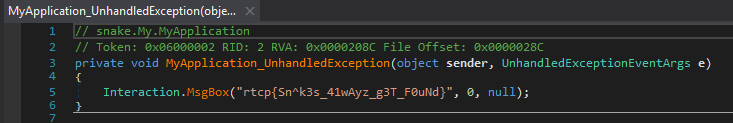

# Snakes

* Solves: 143
* Points: 500
* Category: Binary/Excecutable

♪ Should've known,
Should've known,
Should've known,
Should've known -

Snakes don't have no shoulders to lean on

They just need a prey they can feed on

They get some points so they can drag them home

*original cold-blood killer*

*never knew something so wicked, oh*

Come and get your points where they aren't supposed to go. ♪

### Hint 1

https://github.com/JEF1056/riceteacatpanda/tree/master/Snakes%20(500)

## Challenge

You were given `snake.exe`, `advanced_scores.txt` and `basic_scores.txt`.

Both txt files had the following content.

```
unnamed 0
unnamed 0
unnamed 0
unnamed 0
unnamed 0
```

## Solution

At first I wanted to check what kind of executable the exe is, so I ran the
`file` command on them.

```
file snake.exe
snake.exe: PE32 executable (GUI) Intel 80386 Mono/.Net assembly, for MS Windows
```

I immediately threw `snake.exe` into `dnSpy` to decompile the program. After 
searching a bit for the functionality of the program I stumbled accross the 
flag.



Alternatively `strings` with `-e l` would've helped which changes the 
encoding to 16 bit little endian, which is what windows uses by default.

```
strings -e l snake.exe | grep rtcp
rtcp{Sn^k3s_41wAyz_g3T_F0uNd}
```
